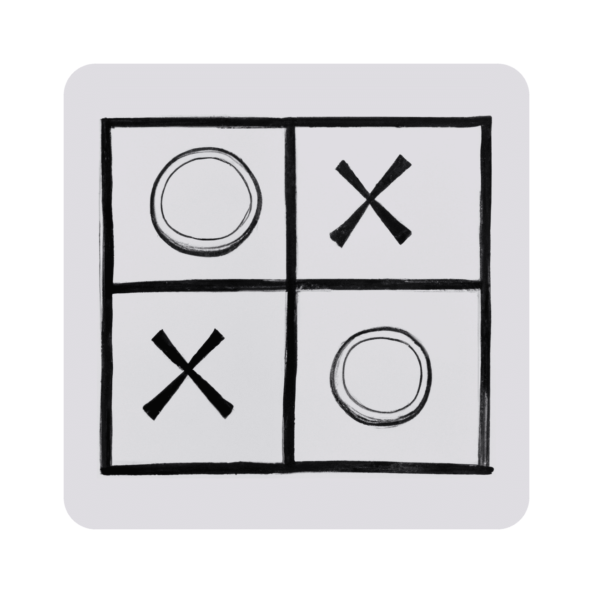

<div align="center">
  <h3>Tic-Tac-Toe</h3>
  
  
  A simple and strong Tic-Tac-Toe app.
  
  [![License][license-badge]][license-link]
  <br>
  [![Release][release-badge]][release-link]
  [![Commits][commits-badge]][commits-link]

</div>

## About
Tic Tac Toe is a very famous board game, and it is very easy to implement in code. Because of this, I wanted to make it a bit more challenging without changing the basic concepts of the game. To achieve this, I implemented the game using the `API System 5` Semaphores and shared memory of Linux to manage both players' turns and the board control.

## How to Use

The game prompts both players for the coordinates of their next move. First, it asks for the row, and then the column. Let's say that a coordinate is made up of (row, column). The board display is as follows:
```
+-------+-------+-------+
| (0,0) | (0,1) | (0,2) |
+-------+-------+-------+ These are the game board
| (1,0) | (1,1) | (1,2) | coordinates
+-------+-------+-------+
| (2,0) | (2,1) | (2,2) |
+-------+-------+-------+

```
Let's see an example:
```
+---+---+---+
| x |   |   |
+---+---+---+   We can see that the 'x' player made a move at
|   |   |   |   (0,0), and the 'o' player made a move at (2,1).
+---+---+---+
|   | o |   |
+---+---+---+
```
In the game, player1 is represented by `x`, and player2 is represented by `o`.

## Modes
With the current version of `ttt v1.0.0`, you can play the famous game with another person or by yourself in the same terminal, automatically switching turns so both players can participate. The current version does not accept arguments since it only has one game mode, although it is expected to have more modes in the future and therefore will require some arguments.

## Compile
To compile and manage all the files of the project, the `Makefile` script has been created. This script can be passed different instructions as parameters, which it will check and execute on the project. Let's see some examples:
```bash
make clean # Cleans all the .o files and the old executable
make # Compiles the project
```

## Structure
```
tic-tac-toe/
├── CONTRIBUTORS
├── doc
│   ├── help.txt
│   └── version.txt
├── LICENSE
├── READMEes.md
├── README.md
├── src
│   ├── board.c
│   ├── board.h
│   ├── constants.h
│   ├── dependencies.txt
│   ├── main.c
│   ├── Makefile
│   ├── resources.c
│   ├── resources.h
│   ├── search.c
│   ├── search.h
│   ├── utils.c
│   └── utils.h
└── tic-tac-toe.6

3 directories, 19 files
```

[wiki-link]:          https://github.com/dpv927/tic-tac-toe/wiki
[issue-link]:         https://github.com/dpv927/tic-tac-toe/issues
[discussions-link]:   https://github.com/official-stockfish/Stockfish/actions/workflows/stockfish.yml
[releases-link]:      https://github.com/official-stockfish/Stockfish/actions/workflows/stockfish.yml

[license-link]:       https://github.com/official-stockfish/Stockfish/actions/workflows/stockfish.yml
[release-link]:       https://github.com/official-stockfish/Stockfish/actions/workflows/stockfish.yml
[commits-link]:       https://github.com/official-stockfish/Stockfish/actions/workflows/stockfish.yml

[commits-badge]:      https://img.shields.io/github/commits-since/dpv927/tic-tac-toe/latest?style=for-the-badge&color=f5f5f5
[license-badge]:      https://img.shields.io/github/license/dpv927/tic-tac-toe?style=for-the-badge&label=license&color=7f848e
[release-badge]:      https://img.shields.io/github/v/release/dpv927/tic-tac-toe?style=for-the-badge&label=official%20release&color=f5f5f5
